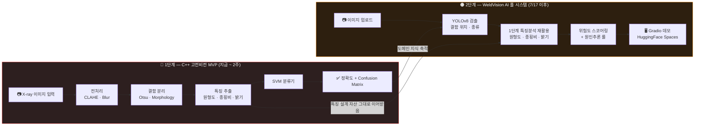
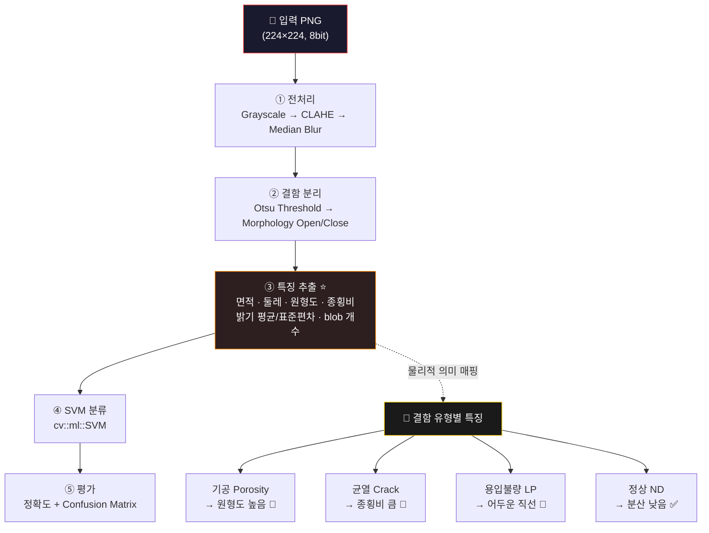
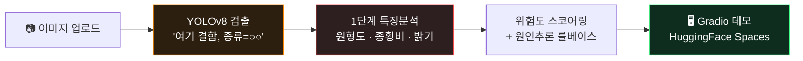
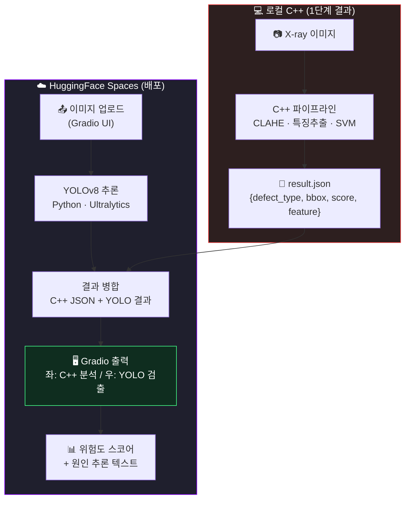

<div align="center">

# 🔥 WeldVision
### AI 기반 용접 결함 자동 검출 및 품질 분석 시스템


> C++ 고전비전으로 결함의 물리적 특성을 직접 이해하는 것부터 시작해,  
> 특징 분석 → YOLO 검출 → 위험도 추론까지 단계적으로 쌓아가는 프로젝트입니다.

</div>

---

## 🗺️ 전체 로드맵



---

## 🔴 1단계 — C++ 고전비전 MVP

> **목표:** 용접 X-ray 이미지에서 결함을 이미지 처리 + SVM으로 자동 분류  
> **핵심:** 딥러닝 없이, CPU만으로, 전부 C++

### 왜 고전비전인가?
- 산업 현장 검사 시스템 상당수가 룰베이스 OpenCV C++ — 실무 직결
- 결함의 물리적 특성을 직접 수식으로 이해 → 2단계 원인추론의 씨앗

### 처리 파이프라인



### 데이터셋
- **RIAWELC** — 224×224 방사선 용접 이미지 24,407장, 4클래스
- LP(용입불량) / PO(기공) / CR(균열) / ND(정상)

### 진행 현황

| Day | 내용 | 상태 |
|-----|------|------|
| 1 | OpenCV C++ 환경설정 + 이미지 출력 | ✅ |
| 2~3 | 한글 경로 처리 + JSON 파싱 + 폴리곤 시각화 | ✅ |
| 4 | 전처리 파이프라인 (grayscale, blur, canny edge) | ✅ |
| 5 | 컨투어 검출 + 바운딩 박스 | ✅ |
| 6 | 특징 추출 (면적, 둘레, 가로세로비) | ✅ |
| 7 | 규칙 기반 분류기 + putText | ✅ |
| 8 | 배치 처리 (컨투어 디버깅 중) | ✅ |
| **9** | **GT 폴리곤 시각화 + 멀티뷰 (CLAHE·Canny·GT)** | **👈 여기까지** |
| 10 | SVM 학습 + 정확도 측정 | 🔜 |
| 11 | Confusion Matrix + 결과 정리 | 🔜 |
| 12 | README polish + 지원 완료 | 🔜 |

---

## 🟠 2단계 — WeldVision AI 풀 시스템

> **목표:** 검출 + 위험도 해석 + 대시보드  
> **핵심:** 1단계를 버리지 않고 두뇌로 재활용

### 위험도 스코어링

| 결함 종류 | 위험도 | 권장 조치 | 1단계 특징 연결 | 주요 원인 |
|-----------|--------|-----------|----------------|-----------|
| 균열 Crack | 🔴 100 | 즉시 재작업 | 종횡비 큼 | 냉각 속도 너무 빠름 |
| 용입불량 LP | 🔴 80 | 재검사 | 어두운 직선 띠 | 전류 너무 낮음 |
| 언더컷 | 🟠 60 | 보수 용접 | 가장자리 형상 | 전류 너무 높음 · 속도 빠름 |
| 기공 Porosity | 🟡 50 | 주의 관찰 | 원형도 높음 | 습기 · 가스 혼입 |
| 슬래그혼입 | 🟡 40 | 경미한 결함 | 밝기·텍스처 이상 | 이전 층 청소 미흡 |

### 2단계 흐름



---

## 🚀 배포 계획 — HuggingFace Spaces + Gradio

> **목표:** C++ 결과 + YOLOv8 결과를 나란히 보여주는 웹 데모  
> **핵심:** C++을 버리지 않고, JSON 브리지로 Python과 연결

### 왜 HuggingFace Spaces인가?

HuggingFace Spaces는 Gradio 앱을 무료로 24/7 호스팅 — GPU 옵션도 제공합니다.  
C++ 결과 시각화를 Python과 연결하기 위해 C++ → JSON → Gradio 파이프라인으로 구성합니다.

### 아키텍처



### C++ → JSON 출력 포맷 (설계 예정)

```json
{
  "filename": "KakaoTalk_Image_2025.jpg",
  "defects": [
    {
      "type": "crack",
      "bbox": [120, 340, 200, 380],
      "circularity": 0.21,
      "aspect_ratio": 4.5,
      "mean_brightness": 89.3,
      "svm_score": 0.91
    }
  ],
  "stage": "cpp_classical_vision"
}
```

### Gradio UI 설계

```python
import gradio as gr

with gr.Blocks(title="WeldVision", theme=gr.themes.Soft()) as demo:
    gr.Markdown("# 🔥 WeldVision — 용접 결함 검출 데모")
    gr.Markdown("X-ray 이미지를 업로드하면 C++ 분석 결과 + YOLOv8 검출 결과를 비교합니다.")

    with gr.Row():
        with gr.Column():
            img_input = gr.Image(label="📷 X-ray 이미지 업로드", type="filepath")
            run_btn = gr.Button("🔍 검출 시작", variant="primary")

        with gr.Column():
            cpp_output  = gr.Image(label="🔴 C++ 분석 (GT 폴리곤 + 특징)")
            yolo_output = gr.Image(label="🟠 YOLOv8 검출")

    with gr.Row():
        result_text = gr.Textbox(label="📊 결함 요약 + 위험도", lines=4)

    run_btn.click(fn=predict, inputs=img_input,
                  outputs=[cpp_output, yolo_output, result_text])
```

| 영역 | 내용 |
|------|------|
| 좌상단 | 이미지 업로드 + 검출 버튼 |
| 우상단 | C++ 분석 결과 / YOLOv8 검출 결과 나란히 |
| 하단 | 결함 요약 + 위험도 스코어 텍스트 |
| 추가 | 결함 원인 진단 ("이 결함은 이런 원인으로 생겼을 가능성이 높습니다") |

### 배포 단계

| 단계 | 내용 |
|------|------|
| ① | C++ SVM 완성 → JSON 출력 기능 추가 |
| ② | YOLOv8 파인튜닝 (용접 데이터셋 학습) |
| ③ | Gradio 앱 작성 (JSON 읽기 + YOLO 추론 + 시각화) |
| ④ | HuggingFace Spaces `gradio` SDK로 배포 |
| ⑤ | C++ 결과 / YOLO 결과 나란히 비교 데모 완성 |

---

## 🛠️ 기술 스택

| 단계 | 기술 |
|------|------|
| 1단계 | C++17, OpenCV, CMake, vcpkg, nlohmann_json |
| 2단계 | Python, YOLOv8 (Ultralytics), Plotly |
| 배포 | Gradio, HuggingFace Spaces, C++→JSON 브리지 |

## 📁 프로젝트 구조

```
welding-defect-detection/
├── src/
│   └── main.cpp          # 메인 처리 파이프라인
├── build/                # CMake 빌드 결과물
├── config.json           # 로컬 경로 설정 (git 제외)
├── config.json.example   # 경로 설정 예시
├── CMakeLists.txt        # 빌드 설정
├── run.bat               # Windows 실행 배치파일
└── README.md
```

## ⚙️ 빌드 및 실행

**1. config.json 생성**
```bash
cp config.json.example config.json
# config.json 열어서 본인 경로로 수정
```

**2. CMake 빌드 (Windows)**
```bash
mkdir build && cd build
cmake .. -DCMAKE_TOOLCHAIN_FILE=D:/vcpkg/scripts/buildsystems/vcpkg.cmake \
         -DVCPKG_TARGET_TRIPLET=x64-windows \
         -DOpenCV_DIR="C:/Users/{사용자}/Downloads/opencv/build/x64/vc16/lib"
cmake --build . --config Release
```

**3. 실행**
```bash
# run.bat 더블클릭 또는
$env:PATH += ";C:/Users/{사용자}/Downloads/opencv/build/x64/vc16/bin"
./build/Release/main.exe
```

---

<div align="center">
  <sub>🔥 불똥처럼 — 작은 불꽃에서 시작해서 크게 번진다</sub>
</div>
