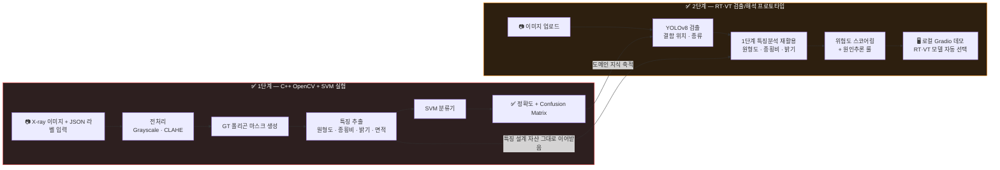
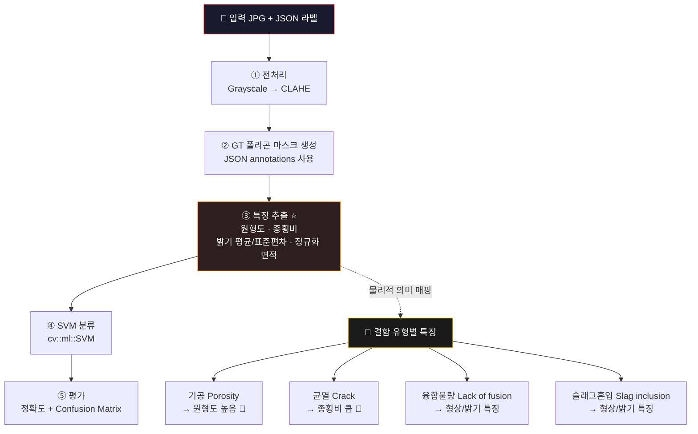
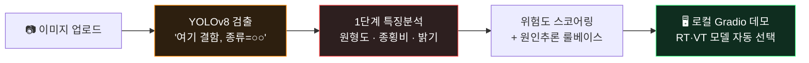
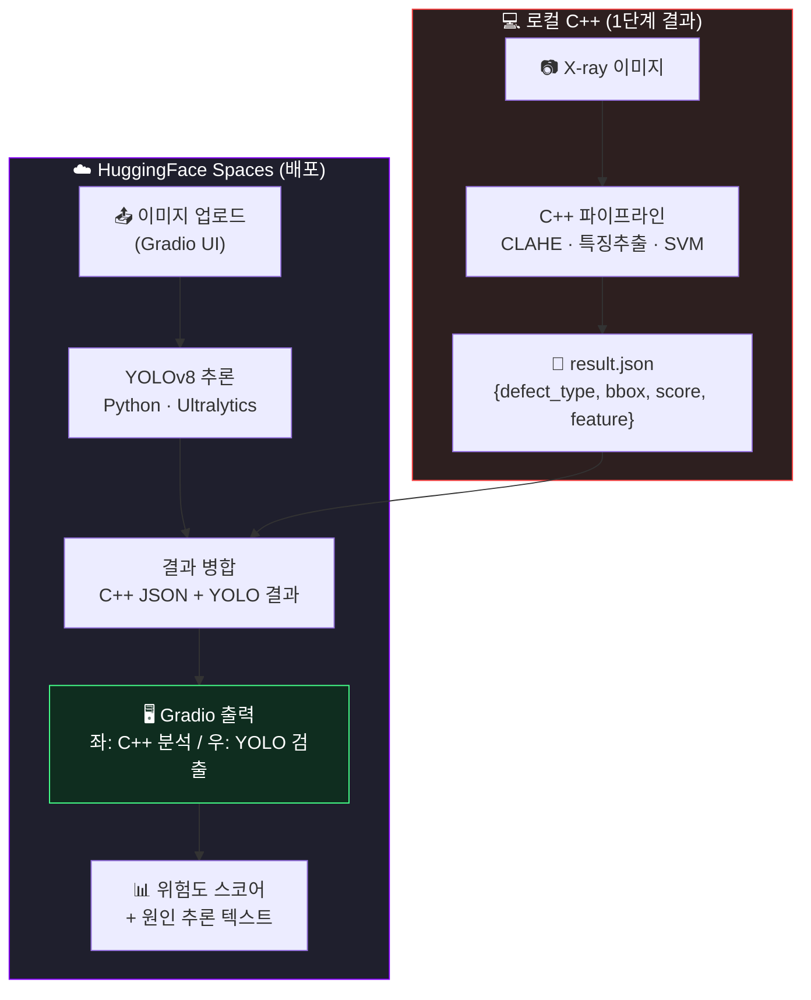

<div align="center">

# 🔥 WeldVision
### RT·VT 용접 결함 검출 및 해석 프로토타입


> C++ 고전비전으로 결함의 물리적 특성을 직접 이해하는 것부터 시작해,
> GT 폴리곤 기반 SVM 4클래스 분류와 RIAWELC→YOLO 변환 파이프라인을 구현했습니다.
> 현재는 RT·VT 전용 YOLOv8 모델을 Gradio 앱에 연결해 결함 위치·종류·판독 근거를 함께 확인할 수 있습니다.

</div>

---

## 📚 문서

- [최종 프로젝트 보고서](docs/final-project-report.md): 목표, 구성, RT·VT 학습 결과, 검증 사례, 한계
- [시연 사용 가이드](docs/demo-guide.md): 실행, RT·VT 선택, 결과 해석, 문제 확인 순서
- [VT YOLOv8 학습 기록](docs/vt-training-2026-07-25.md): 데이터 구성과 클래스별 성능
- [Phase 2 개발 안내](phase2/README.md): 코드 실행과 데이터 변환 방법

---

## 🗺️ 전체 로드맵


```mermaid
flowchart LR
    subgraph S1["✅ 1단계 — C++ OpenCV + SVM 실험"]
        A[📷 X-ray 이미지 + JSON 라벨 입력] --> B[전처리\nGrayscale · CLAHE]
        B --> C[GT 폴리곤 마스크 생성]
        C --> D[특징 추출\n원형도 · 종횡비 · 밝기 · 면적]
        D --> E[SVM 분류기]
        E --> F[✅ 정확도 + Confusion Matrix]
    end

    subgraph S2["✅ 2단계 — RT·VT 검출/해석 프로토타입"]
        G[📷 이미지 업로드] --> H[YOLOv8 검출\n결함 위치 · 종류]
        H --> I[1단계 특징분석 재활용\n원형도 · 종횡비 · 밝기]
        I --> J[위험도 스코어링\n+ 원인추론 룰]
        J --> K[🖥️ 로컬 Gradio 데모\nRT·VT 모델 자동 선택]
    end

    D -- "특징 설계 자산 그대로 이어받음" --> I
    F -- "도메인 지식 축적" --> H

    style S1 fill:#2d1f1f,stroke:#ff4444,color:#fff
    style S2 fill:#2d1f0f,stroke:#ff8800,color:#fff
```

---

## 🔴 1단계 — C++ OpenCV + SVM 실험

> **목표:** 용접 X-ray 이미지와 JSON 폴리곤 라벨에서 특징을 추출하고 SVM으로 결함 종류를 분류  
> **현재 범위:** 자동 검출이 아니라, 제공된 GT 폴리곤 라벨을 이용한 특징 기반 분류 실험

### 왜 고전비전인가?
- 산업 현장 검사 시스템 상당수가 룰베이스 OpenCV C++ — 실무 직결
- 결함의 물리적 특성을 직접 수식으로 이해 → 2단계 원인추론의 씨앗

### 처리 파이프라인


```mermaid
flowchart TD
    A["📁 입력 JPG + JSON 라벨"] --> B

    B["① 전처리\nGrayscale → CLAHE"]
    B --> C["② GT 폴리곤 마스크 생성\nJSON annotations 사용"]
    C --> D["③ 특징 추출 ⭐\n원형도 · 종횡비\n밝기 평균/표준편차 · 정규화 면적"]
    D --> E["④ SVM 분류\ncv::ml::SVM"]
    E --> F["⑤ 평가\n정확도 + Confusion Matrix"]

    G["🩻 결함 유형별 특징"]
    G --> G1["기공 Porosity\n→ 원형도 높음 🔴"]
    G --> G2["균열 Crack\n→ 종횡비 큼 🔴"]
    G --> G3["융합불량 Lack of fusion\n→ 형상/밝기 특징"]
    G --> G4["슬래그혼입 Slag inclusion\n→ 형상/밝기 특징"]

    D -. "물리적 의미 매핑" .-> G

    style A fill:#1a1a2e,stroke:#ff4444,color:#fff
    style D fill:#2d1f1f,stroke:#ff8800,color:#fff
    style G fill:#1a1a1a,stroke:#ffcc00,color:#fff
```

### 데이터셋
- 방사선 용접 이미지와 JSON 폴리곤 라벨을 사용합니다.
- 현재 코드의 학습 대상 4클래스: crack / porosity / lack of fusion / slag inclusion
- `normal`/`ND` 클래스는 현재 SVM 학습 코드에 포함되어 있지 않습니다.

### 진행 현황

| Day | 내용 | 상태 |
|-----|------|------|
| 1 | OpenCV C++ 환경설정 + 이미지 출력 | ✅ |
| 2~3 | 한글 경로 처리 + JSON 파싱 + 폴리곤 시각화 | ✅ |
| 4 | 전처리 파이프라인 (grayscale, CLAHE, Canny 시각화) | ✅ |
| 5 | GT 폴리곤 시각화 + 바운딩 박스/형상 실험 | ✅ |
| 6 | 특징 추출 (원형도, 종횡비, 밝기 통계, 정규화 면적) | ✅ |
| 7 | 규칙 기반 분류기 + putText | ✅ |
| 8 | 배치 처리 (컨투어 디버깅 중) | ✅ |
| 9 | GT 폴리곤 시각화 + 멀티뷰 (CLAHE·Canny·GT) | ✅ |
| **10** | **SVM 학습 + 정확도 86.2% (4클래스)** | **✅** |
| 11 | Confusion Matrix 분석 + 클래스 불균형 개선 | 일부 구현 / 개선 예정 |
| 12 | 최종 보고서 + 시연 가이드 + README 정리 | ✅ |

---

## ✅ 2단계 — 검출/해석/데모 확장

> **목표:** 검출 + 위험도 해석 + 대시보드  
> **상태:** RT·VT 전용 YOLOv8 모델을 각각 학습하고 Gradio 대시보드에서 검사 방식에 따라 선택하도록 연결했습니다.

### 위험도 스코어링 아이디어

| 결함 종류 | 위험도 | 권장 조치 | 1단계 특징 연결 | 주요 원인 |
|-----------|--------|-----------|----------------|-----------|
| 균열 Crack | 🔴 100 | 즉시 재작업 | 종횡비 큼 | 냉각 속도 너무 빠름 |
| 융합불량 Lack of Fusion | 🔴 80 | 재검사 | 길게 이어지는 결합 불량 | 전류 부족 · 속도 과다 |
| 용입부족 Incomplete Penetration | 🔴 75 | 재검사 | 루트부 용입 깊이 부족 | 입열 부족 · 루트 간격 문제 |
| 언더컷 | 🟠 60 | 보수 용접 | 가장자리 형상 | 전류 너무 높음 · 속도 빠름 |
| 기공 Porosity | 🟡 50 | 주의 관찰 | 원형도 높음 | 습기 · 가스 혼입 |
| 슬래그혼입 | 🟡 40 | 경미한 결함 | 밝기·텍스처 이상 | 이전 층 청소 미흡 |

### 2단계 흐름


```mermaid
flowchart LR
    A[📷 이미지 업로드] --> B["YOLOv8 검출\n'여기 결함, 종류=○○'"]
    B --> C["1단계 특징분석\n원형도 · 종횡비 · 밝기"]
    C --> D["위험도 스코어링\n+ 원인추론 룰베이스"]
    D --> E["🖥️ 로컬 Gradio 데모\nRT·VT 모델 자동 선택"]

    style B fill:#2d1f0f,stroke:#ff8800,color:#fff
    style C fill:#2d1f1f,stroke:#ff4444,color:#fff
    style E fill:#0f2d1f,stroke:#44ff88,color:#fff
```

### 2단계 구현 결과 — RT·VT Gradio 해석 대시보드

> 최초 구현 브랜치 `phase2-gradio-dashboard`의 코드가 현재 `main`에 병합되어 있습니다.

검출 결과를 설명하고 시각화하는 Gradio 대시보드에 RT·VT YOLOv8 모델을 연결했습니다.

현재 포함된 기능:

- 이미지 업로드
- RT / VT 검사 방식 선택 및 전용 모델 자동 연결
- 원본 이미지와 후보 검출 결과 비교
- OpenCV 전처리 근거 화면 제공: CLAHE, Black-hat, Gradient, Emboss
- 슬라이더 기반 자동 재분석
- 특징값 출력: Circularity, Aspect Ratio, Mean Brightness
- 결함별 위험도 점수 출력
- 추정 원인 및 권장 조치 출력
- 한글 UI + 영어 기술명 병기

현재 `YOLOv8 모델 경로`가 비어 있으면 OpenCV 기반 후보 검출 모드가 동작합니다. 이때 표시되는 박스는 최종 AI 판정이 아니라, Black-hat 전처리에서 강조된 어두운 영역을 확인하기 위한 보조 후보입니다.

<details>
<summary>설계 메모 보기</summary>

- YOLOv8은 결함의 위치와 종류를 검출하는 역할로 두고, OpenCV는 검출 결과를 설명하는 보조 분석 역할로 분리했습니다.
- 1단계에서 사용한 원형도, 종횡비, 밝기 특징값은 2단계의 위험도 스코어링과 원인 추론에 재사용합니다.
- Canny는 용접부 질감과 노이즈까지 과검출할 수 있어 핵심 전처리에서 제외하고, CLAHE / Black-hat / Gradient / Emboss를 중심으로 구성했습니다.
- OpenCV 후보 검출은 YOLOv8 모델 경로가 없을 때 전처리 근거를 확인하기 위한 보조 기능이며, 최종 AI 판정으로 사용하지 않습니다.

</details>

<details>
<summary>추가 작업 메모 보기</summary>

- 2026-07-17: Gradio 기반 2단계 해석 대시보드 1차 구현 완료
- 2026-07-21: Mac MPS에서 6클래스 10 epoch 파일럿 학습 완료 (mAP50 0.358)
- 2026-07-24: RTX 4070에서 RT 4클래스 균형 모델을 추가 학습하고 Gradio에 연결 (mAP50 0.413)
- 2026-07-22: RGB/BGR 입력 오류, 겹친 클래스 제거, 저신뢰도 후보 표시 문제 수정
- 2026-07-25: VT 4클래스 균형 모델 30 epoch 학습 및 RT/VT 선택 기능 연결 (mAP50 0.847)
- 남은 개선: 독립 현장 이미지 평가 → 실패 사례 확대 → RT·언더컷 성능 개선

</details>

전체 결과와 한계는 [최종 프로젝트 보고서](docs/final-project-report.md), 사용 순서는 [시연 사용 가이드](docs/demo-guide.md), VT 세부 학습 결과는 [VT 학습 기록](docs/vt-training-2026-07-25.md)에 정리했습니다.

---

## 🚀 배포 계획 — HuggingFace Spaces + Gradio

> **목표:** C++ 결과 + YOLOv8 결과를 나란히 보여주는 웹 데모  
> **상태:** 로컬 Gradio 앱은 구현되어 있지만 HuggingFace Spaces 배포 설정과 C++ 결과 연동은 아직 구현되지 않았습니다.

### 왜 HuggingFace Spaces인가?

HuggingFace Spaces는 Gradio 앱 호스팅과 GPU 옵션을 제공합니다.  
이후 C++ 결과 시각화를 Python과 연결하기 위해 C++ → JSON → Gradio 파이프라인을 구성할 예정입니다.

### 아키텍처 구상


```mermaid
flowchart TD
    subgraph LOCAL["💻 로컬 C++ (1단계 결과)"]
        A["📷 X-ray 이미지"] --> B["C++ 파이프라인\nCLAHE · 특징추출 · SVM"]
        B --> C["📄 result.json\n{defect_type, bbox, score, feature}"]
    end

    subgraph HF["☁️ HuggingFace Spaces (배포)"]
        D["📤 이미지 업로드\n(Gradio UI)"] --> E["YOLOv8 추론\nPython · Ultralytics"]
        E --> F["결과 병합\nC++ JSON + YOLO 결과"]
        C --> F
        F --> G["🖥️ Gradio 출력\n좌: C++ 분석 / 우: YOLO 검출"]
        G --> H["📊 위험도 스코어\n+ 원인 추론 텍스트"]
    end

    style LOCAL fill:#2d1f1f,stroke:#ff4444,color:#fff
    style HF fill:#1f1f2d,stroke:#8800ff,color:#fff
    style G fill:#0f2d1f,stroke:#44ff88,color:#fff
```

### C++ → JSON 출력 포맷

현재 코드는 SVM 평가 결과를 `result.json`으로 저장합니다. 아래 포맷은 이후 이미지별 검출 결과와 연동하기 위한 설계 예시입니다.

```json
{
  "filename": "KakaoTalk_Image_2025.jpg",
  "defects": [
    {
      "type": "crack",
      "bbox": [120, 340, 200, 380],
      "circularity": 0.21,
      "aspect_ratio": 4.5,
      "mean_brightness": 89.3,
      "svm_score": 0.91
    }
  ],
  "stage": "cpp_classical_vision"
}
```

### Gradio UI 설계 예시

```python
import gradio as gr

with gr.Blocks(title="WeldVision", theme=gr.themes.Soft()) as demo:
    gr.Markdown("# 🔥 WeldVision — 용접 결함 검출 데모")
    gr.Markdown("X-ray 이미지를 업로드하면 C++ 분석 결과 + YOLOv8 검출 결과를 비교합니다.")

    with gr.Row():
        with gr.Column():
            img_input = gr.Image(label="📷 X-ray 이미지 업로드", type="filepath")
            run_btn = gr.Button("🔍 검출 시작", variant="primary")

        with gr.Column():
            cpp_output  = gr.Image(label="🔴 C++ 분석 (GT 폴리곤 + 특징)")
            yolo_output = gr.Image(label="🟠 YOLOv8 검출")

    with gr.Row():
        result_text = gr.Textbox(label="📊 결함 요약 + 위험도", lines=4)

    run_btn.click(fn=predict, inputs=img_input,
                  outputs=[cpp_output, yolo_output, result_text])
```

| 영역 | 내용 |
|------|------|
| 좌상단 | 이미지 업로드 + 검출 버튼 |
| 우상단 | C++ 분석 결과 / YOLOv8 검출 결과 나란히 |
| 하단 | 결함 요약 + 위험도 스코어 텍스트 |
| 추가 | 결함 원인 진단 ("이 결함은 이런 원인으로 생겼을 가능성이 높습니다") |

### 배포 단계

| 단계 | 내용 |
|------|------|
| ① | C++ SVM 실험과 특징 분석 완료 |
| ② | RT·VT YOLOv8 파인튜닝 완료 |
| ③ | 로컬 Gradio 앱과 YOLO 추론 연결 완료 |
| ④ | HuggingFace Spaces 배포 검토 (선택 사항) |
| ⑤ | C++ 결과 직접 연동 검토 (선택 사항) |

---

## 🛠️ 기술 스택

| 단계 | 기술 |
|------|------|
| 1단계 | C++17, OpenCV, CMake, vcpkg, nlohmann_json |
| 2단계 프로토타입 | Python, OpenCV, Gradio, pandas, YOLOv8 (Ultralytics) |
| 배포 계획 | Gradio, HuggingFace Spaces, C++→JSON 브리지 |

## 📁 프로젝트 구조

```
welding-defect-detection/
├── src/
│   ├── main.cpp          # 메인 처리 파이프라인
│   └── visualize.py      # Python 라벨 시각화 실험 코드
├── phase2/
│   ├── gradio_app.py     # Gradio 해석 대시보드
│   ├── vision.py         # 전처리·YOLO/OpenCV 후보 검출·특징 추출
│   ├── rules.py          # 위험도·원인·권장 조치 규칙
│   ├── prepare_yolo_dataset.py # JSON 폴리곤 → YOLO 데이터 변환
│   ├── test_*.py         # Phase 2 단위 테스트
│   ├── requirements.txt  # Python 의존성
│   └── README.md         # Phase 2 상세 설명
├── docs/
│   ├── final-project-report.md # 최종 프로젝트 보고서
│   └── demo-guide.md     # 시연 사용 가이드
├── config.json           # 로컬 경로 설정 (현재 저장소에 포함됨)
├── config.json.example   # 경로 설정 예시
├── CMakeLists.txt        # 빌드 설정
├── CMakeLists_win.txt    # 이전 Windows용 CMake 설정
├── run.bat               # Windows 실행 배치파일
└── README.md
```

## ⚙️ 빌드 및 실행

### Stage 1 — C++ OpenCV + SVM

**1. 의존성 준비**

- 공통: CMake 3.15+, C++17 컴파일러, OpenCV, nlohmann-json
- Windows: Visual Studio와 vcpkg 사용 권장
- macOS: Homebrew를 사용한다면 `brew install cmake opencv nlohmann-json`

**2. config.json 생성**
```bash
cp config.json.example config.json
# config.json 열어서 본인 경로로 수정
```

> 참고: 현재 저장소에는 `config.json`도 함께 포함되어 있습니다. 다른 환경에서 실행하려면 `data_dir`, `label_dir`를 본인 데이터셋 경로로 수정해야 합니다.

**3-A. CMake 빌드 (macOS)**
```bash
cmake -S . -B build \
  -DOpenCV_DIR="$(brew --prefix opencv)/lib/cmake/opencv4"
cmake --build build -j
```

**4-A. 실행 (macOS)**
```bash
├── config.json           # 로컬 경로 설정 (현재 저장소에 포함됨)
├── config.json.example   # 경로 설정 예시
├── CMakeLists.txt        # 빌드 설정
├── CMakeLists_win.txt    # 이전 Windows용 CMake 설정
├── run.bat               # Windows 실행 배치파일
└── README.md
```

## ⚙️ 빌드 및 실행

### Stage 1 — C++ OpenCV + SVM

**1. 의존성 준비**

- 공통: CMake 3.15+, C++17 컴파일러, OpenCV, nlohmann-json
- Windows: Visual Studio와 vcpkg 사용 권장
- macOS: Homebrew를 사용한다면 `brew install cmake opencv nlohmann-json`

**2. config.json 생성**
```bash
cp config.json.example config.json
# config.json 열어서 본인 경로로 수정
```

> 참고: 현재 저장소에는 `config.json`도 함께 포함되어 있습니다. 다른 환경에서 실행하려면 `data_dir`, `label_dir`를 본인 데이터셋 경로로 수정해야 합니다.

**3-A. CMake 빌드 (macOS)**
```bash
cmake -S . -B build \
  -DOpenCV_DIR="$(brew --prefix opencv)/lib/cmake/opencv4"
cmake --build build -j
```

**4-A. 실행 (macOS)**
```bash
./build/main
```

메뉴에서 `1`을 선택하면 OpenCV 이미지 창이 열립니다. 각 이미지는 키를 눌러 다음 이미지로 이동합니다. `2`를 선택하면 SVM 학습·평가 후 `svm_model.xml`과 `result.json`을 실행 디렉터리에 저장합니다.

**3-B. CMake 빌드 (Windows)**
```bash
cmake -S . -B build
cmake --build build --config Release
```

**4-B. 실행 (Windows PowerShell)**
```powershell
.\build\Release\main.exe
```

`run.bat`을 사용할 때는 필요하면 `OPENCV_BIN` 환경 변수에 OpenCV DLL 폴더를 지정합니다. 배치파일은 자신의 위치를 프로젝트 루트로 사용하므로 저장소 경로를 직접 수정할 필요가 없습니다.

---

### 🟢 Stage 2 — Gradio 해석 대시보드 시연

운영체제별 **원클릭 구동 스크립트**를 이용하여 즉시 대시보드를 시연할 수 있습니다:

* **Windows**:
  ```cmd
  run_demo.bat
  ```
* **macOS / Linux**:
  ```bash
  chmod +x run_demo.sh
  ./run_demo.sh
  ```

수동으로 명령어를 입력하여 실행하려면 다음과 같이 구동합니다:

```bash
python3 -m pip install gradio ultralytics opencv-python pandas
python3 phase2/gradio_app.py
```

* 모델 경로를 비워두거나 모델 가중치 파일이 존재하지 않을 경우, 자동으로 **OpenCV 모폴로지 Black-hat 기반 보조 후보 검출 모드**로 안전하게 실행됩니다.
* 학습된 YOLOv8 `best.pt` 가중치 파일이 연결되어 있으면 YOLOv8 딥러닝 검출이 최우선 적용됩니다.

---

<div align="center">
  <sub>🔥 불똥처럼 — 작은 불꽃에서 시작해서 크게 번진다</sub>
</div>
