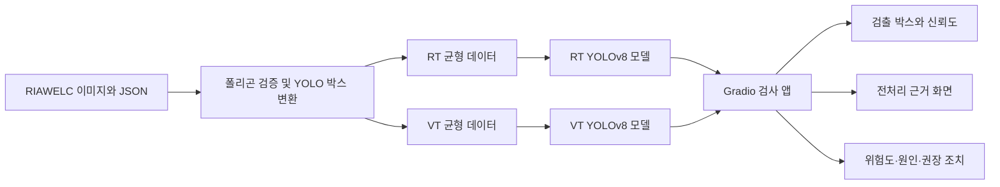

# WeldVision 최종 프로젝트 보고서

## 1. 프로젝트 개요

WeldVision은 용접 검사 이미지에서 결함의 위치와 종류를 찾고, 검사자가 결과를 이해할 수 있도록 전처리 근거 화면과 위험도·추정 원인·권장 조치를 함께 제공하는 로컬 검사 보조 시스템이다.

프로젝트는 두 단계로 진행했다.

1. C++ OpenCV와 SVM을 이용해 결함의 형상·밝기 특징을 이해하고 4개 결함을 분류했다.
2. RIAWELC 폴리곤 라벨을 YOLO 형식으로 변환하고, RT와 VT 전용 YOLOv8 모델을 학습해 Gradio 앱에 연결했다.

이 시스템은 검사자를 대체하거나 품질을 인증하는 장비가 아니라, 결함 후보를 빠르게 확인하고 판단 근거를 함께 살펴보는 교육·시연용 프로토타입이다.

## 2. 문제 정의와 목표

용접 결함은 검사 방식에 따라 영상의 외관과 대상 결함이 다르다. 방사선 검사(RT)는 내부 결함을 투과 영상으로 확인하고, 육안 검사(VT)는 용접부 표면 형상을 확인한다. 하나의 모델에 두 영상 영역을 섞으면 서로 다른 영상 특성과 클래스 구성이 학습을 방해할 수 있으므로 RT와 VT를 별도 모델로 구성했다.

주요 목표는 다음과 같다.

- 기존 JSON 폴리곤 라벨을 재사용해 YOLO 데이터셋을 자동 생성한다.
- RT와 VT 영상에 맞는 별도 결함 검출 모델을 학습한다.
- 이미지 한 장을 업로드하면 결함 위치, 종류, 신뢰도를 화면에 표시한다.
- CLAHE, Black-hat, Gradient, Emboss 화면으로 판독 보조 근거를 제공한다.
- 결함별 위험도, 추정 원인, 권장 조치를 한글로 제공한다.

## 3. 시스템 구성

| 검사 방식 | 모델 클래스 |
|---|---|
| RT | 균열, 기공, 융합불량, 슬래그혼입 |
| VT | 기공, 융합불량, 용입부족, 언더컷 |

`lack_of_fusion`은 융합불량, `incomplete_penetration`은 용입부족으로 구분했다. 두 용어를 같은 결함으로 처리하지 않는다.

## 4. 1단계: OpenCV와 SVM 실험

JSON의 정답 폴리곤으로 관심 영역을 만든 뒤 원형도, 종횡비, 평균 밝기, 밝기 표준편차, 정규화 면적 등의 특징을 추출했다. 이 특징으로 균열, 기공, 융합불량, 슬래그혼입을 분류한 SVM 실험 정확도는 **86.2%**였다.

이 단계는 자동 위치 검출이 아니라 정답 영역을 이용한 분류 실험이다. 대신 결함의 물리적 특징을 코드와 수치로 이해하고, 2단계 앱의 특징 분석과 설명 규칙을 설계하는 기반이 됐다.

## 5. 2단계: YOLO 데이터 변환과 학습

원본 JSON 폴리곤의 최소·최대 좌표를 이용해 긴밀한 YOLO 바운딩 박스를 생성했다. 변환 과정에서는 면적이 0인 박스와 검사 방식에 속하지 않는 클래스가 섞인 항목을 제외했고, 정상 이미지는 빈 라벨 파일로 처리했다.

### 5.1 RT 모델

| 항목 | 값 |
|---|---|
| 모델 | YOLOv8s 기반 연속 학습 |
| 이미지 크기 | 960 |
| Batch size | 8 |
| 추가 학습 | 15 epochs |
| 장치 | NVIDIA GeForce RTX 4070 12GB |
| 최종 mAP50 | 약 0.413 |
| 최종 mAP50-95 | 약 0.164 |

클래스별 mAP50은 균열 0.453, 기공 0.528, 융합불량 0.302, 슬래그혼입 0.370이었다. RT 모델은 전체 흐름을 확인한 파일럿 성격이 강하며, VT 모델보다 데이터와 성능 면에서 개선 여지가 크다.

### 5.2 VT 모델

VT 원본 데이터는 학습 59,212장, 검증 7,398장이었다. 첫 정식 VT 모델에서는 클래스 폴더별 최대 3,000장을 변환하고 기공·정상 이미지의 과도한 비중을 줄여 균형 목록을 구성했다.

| 구분 | 이미지 수 | 비고 |
|---|---:|---|
| Train | 11,456 | 정상 2,000장 포함 |
| Validation | 6,805 | 정상 3,000장 포함 |

학습은 YOLOv8s, 30 epochs, 이미지 크기 960, batch size 8로 진행했고 약 1시간 53분이 걸렸다.

최종 `best.pt` 성능은 Precision 0.849, Recall 0.780, mAP50 0.838, mAP50-95 0.585였다. 학습 중 최고 전체 mAP50은 25 epoch의 **0.847**이었다.

| 클래스 | 검증 이미지 | 객체 수 | Precision | Recall | mAP50 | mAP50-95 |
|---|---:|---:|---:|---:|---:|---:|
| 기공 | 338 | 9,484 | 0.846 | 0.791 | 0.838 | 0.423 |
| 융합불량 | 630 | 885 | 0.806 | 0.953 | 0.954 | 0.760 |
| 용입부족 | 1,618 | 2,099 | 0.925 | 0.776 | 0.861 | 0.674 |
| 언더컷 | 1,219 | 2,759 | 0.819 | 0.601 | 0.698 | 0.482 |

융합불량과 용입부족은 높은 mAP50을 보였고, 언더컷은 여러 개의 작고 연속적인 결함으로 표시되는 특성 때문에 Recall이 상대적으로 낮았다.

## 6. Gradio 앱 구현

앱은 `방사선 검사(RT)`와 `육안 검사(VT)`를 선택할 수 있으며 선택한 방식에 맞는 모델 경로와 기본 신뢰도를 자동 적용한다.

| 검사 방식 | 기본 모델 | 기본 신뢰도 |
|---|---|---:|
| RT | `runs/detect/rt-v4-balanced/weights/best.pt` | 0.10 |
| VT | `runs/detect/vt-v1-balanced/weights/best.pt` | 0.25 |

주요 기능은 원본·검출 결과 비교, 낮은 신뢰도 후보 표시, 네 가지 전처리 화면, 형상 특징값, 위험도·추정 원인·권장 조치 출력이다. 모델이 없을 때는 OpenCV 후보 검출도 사용할 수 있다.

전처리 슬라이더는 판독 보조 화면과 OpenCV 후보에 영향을 주며 YOLO 모델을 다시 학습시키지는 않는다. YOLO 검출 결과를 직접 조절하는 값은 `YOLO 신뢰도`다.

## 7. 기능 확인 사례

| 이미지 | 정답 종류 | 앱 결과 | 확인 내용 |
|---|---|---|---|
| `VT_ST_03_14601260.jpg` | 용입부족 | 용입부족 0.755 | 주요 박스가 JSON 영역과 거의 일치 |
| `VT_ST_03_14601258.jpg` | 용입부족 | 용입부족 0.77 | 종류는 정확, 박스는 정답보다 좁음 |
| `VT_ST_04_14617438.jpg` | 융합불량 | 융합불량 최고 0.783 | VT 모드에서 종류를 정확히 구분 |
| `VT_ST_06_14623739.jpg` | 언더컷 | 언더컷 0.309 | 낮지만 기본 임계값을 넘어 검출 |
| `VT_ST_06_14623749.jpg` | 언더컷 26개 | 언더컷 27개, 최고 0.832 | 다수 영역 포착, 중복·오검출 후보 존재 |

위 사례는 브라우저에서 모델 연결과 화면 출력을 확인한 **기능 검증 사례**다. 일부는 학습 폴더에서 선택했으므로 독립적인 현장 성능 평가 자료로 사용하지 않는다. 모델 성능 수치는 별도의 검증 목록에서 계산한 지표를 사용했다.

## 8. 한계와 개선 방향

- RT 모델의 mAP50은 약 0.413으로 아직 파일럿 수준이다.
- VT 언더컷은 Recall 0.601로 다른 클래스보다 놓치는 비율이 높다.
- 새로운 설비·재질·촬영 조건에 대한 일반화 성능은 확인하지 않았다.
- 겹친 박스와 낮은 신뢰도 후보가 생길 수 있으므로 원본 이미지와 함께 판단해야 한다.
- OpenCV 후보 검출은 전처리 근거 확인용이며 학습된 AI의 최종 판정이 아니다.
- 모델 가중치는 용량 때문에 Git에 포함하지 않고 로컬 경로에서 관리한다.

다음 개선 단계는 학습에 사용하지 않은 별도 현장 이미지 수집, RT 데이터 확대, 언더컷 라벨·중복 박스 검토, 검사 방식별 임계값 보정이다.

## 9. 최종 결과

데이터 변환, RT·VT 별도 모델 학습, 웹 기반 검출·해석 화면 연결을 완료했다. Stage 1의 특징 기반 분석에서 Stage 2의 딥러닝 위치 검출까지 하나의 흐름으로 확장했으며, 사용자가 검사 방식과 이미지를 선택해 직접 결과를 확인할 수 있는 실행 가능한 프로토타입을 만들었다.

실행과 시연 순서는 [시연 사용 가이드](demo-guide.md), 세부 VT 학습 로그는 [VT 학습 기록](vt-training-2026-07-25.md)을 참고한다.
